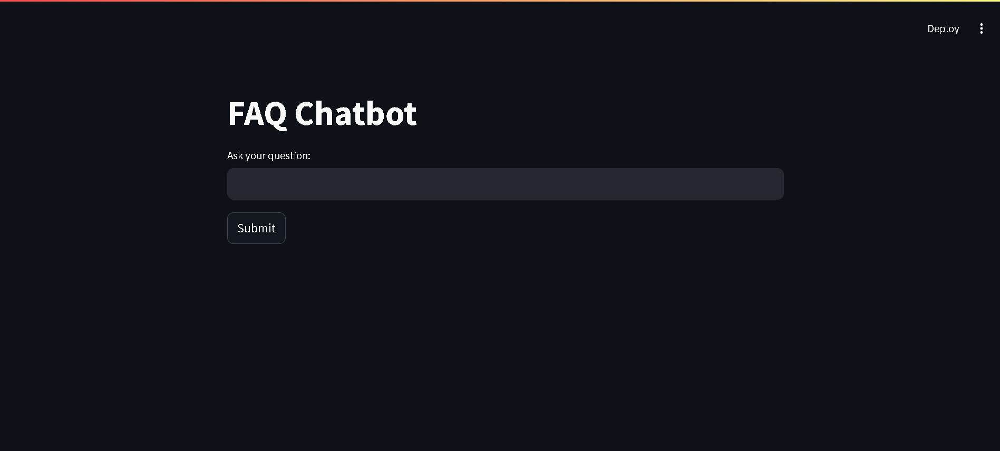
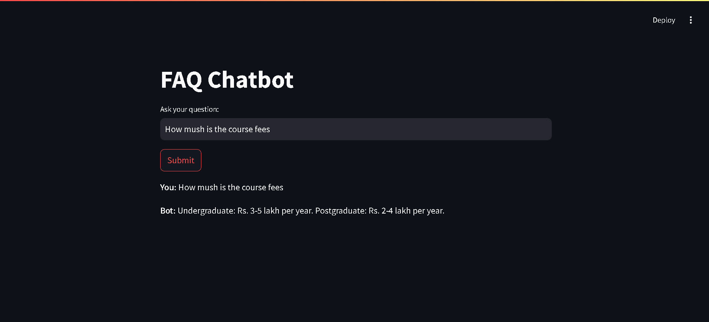
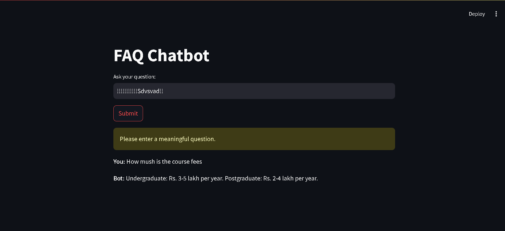

## FAQ Chatbot

This is a simple FAQ chatbot project made using Python, Streamlit, and RapidFuzz.
It takes user questions and finds the best matching answer from a dataset.

## About the Project

## This chatbot:

1. Takes a question from the user
2. Compares it with FAQ questions
3. Finds the best match using fuzzy matching
4. Shows the answer in the UI
5. Handles wrong or unclear inputs

## Features

1. Simple chat interface using Streamlit.
2. FAQ matching using RapidFuzz
3. Shows confidence score for answers
4. Handles:
    1. Empty input
    2. Very long input
    3. Gibberish input
5. Saves unanswered questions in a file

## Project Structure

faq-chatbot/
│
├── data/
│   └── faqs.json
│
├── src/
│   ├── data_loader.py
│   ├── matcher.py
│   ├── preprocess.py
│
├── logs/
│   └── unanswered.txt
│
├── tests/
│   └── test_matcher.py
│
├── app.py
├── requirements.txt
└── README.md

## how to run

1. Clone the Project
    git clone https://github.com/<your-username>/faq-chatbot.git
    cd faq-chatbot

2. Create virtual environments
    python -m venv venv
    venv\Scripts\activate   (Windows)

3. Install dependencies
   pip install -r requirements.txt 

4. Run the app
   streamlit run app.py

## sample output images

1. 
   
   

## sample output video

1. Sample_video[Sample video](snapshots/Sample%20recording.mp4)
